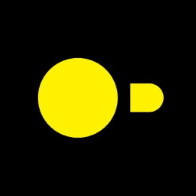

# DuckDB.NET

[DuckDB](https://duckdb.org/) bindings for C#

[](https://github.com/Giorgi/DuckDB.NET/actions/workflows/ci.yml)
[](https://coveralls.io/github/Giorgi/DuckDB.NET)
[](LICENSE.md)
[](https://ko-fi.com/U6U81LHU8)

[](https://www.nuget.org/packages/DuckDB.NET.Data/)
[](https://www.nuget.org/packages/DuckDB.NET.Bindings/)




Note: The library is in early stage and contributions are more than wellcome.

## Usage

### Before you Begin
Before you begin, make sure that duckdb binary is available on your machine and accessible to your project. The easiest option is to put the library in your project directory and set **Copy to Output Directory** to **Copy Always**. Make sure to use the correct binary for your platform: *duckdb.dll* on Windows, *duckdb.so* on Linux and *duckdb.dylib* on macOS.

### Getting Started
There are two ways to work with DuckDB from C#

Using ADO.NET Provider or using low level bindings library for DuckDB. The ADO.NET Provider is built on top of the low level library and is the recommended and most straightforward way for working with DuckDB.

### Using ADO.NET Provider

```sh
dotnet add package DuckDB.NET.Data
```

```cs
using (var duckDBConnection = new DuckDBConnection("Data Source=file.db"))
{
  duckDBConnection.Open();

  var command = duckDBConnection.CreateCommand();

  command.CommandText = "CREATE TABLE integers(foo INTEGER, bar INTEGER);";
  var executeNonQuery = command.ExecuteNonQuery();

  command.CommandText = "INSERT INTO integers VALUES (3, 4), (5, 6), (7, 8);";
  executeNonQuery = command.ExecuteNonQuery();

  command.CommandText = "Select count(*) from integers";
  var executeScalar = command.ExecuteScalar();

  command.CommandText = "SELECT foo, bar FROM integers";
  var reader = command.ExecuteReader();

  PrintQueryResults(reader);
}

private static void PrintQueryResults(DbDataReader queryResult)
{
  for (var index = 0; index < queryResult.FieldCount; index++)
  {
    var column = queryResult.GetName(index);
     Console.Write($"{column} ");
  }

  Console.WriteLine();

  while (queryResult.Read())
  {
    for (int ordinal = 0; ordinal < queryResult.FieldCount; ordinal++)
    {
      var val = queryResult.GetInt32(ordinal);
      Console.Write(val);
      Console.Write(" ");
    }

    Console.WriteLine();
  }
}
```

#### Parameterized queries and DuckDB native types.

Starting from version 0.4.0.10, DuckDB.NET.Data supports executing parameterized queries and reading all built-in native duckdb types:

```cs
using var connection = new DuckDBConnection("DataSource=:memory:");
connection.Open();

var command = connection.CreateCommand();
command.CommandText = "SELECT * from integers where foo > ?;";
command.Parameters.Add(new new DuckDBParameter(3));

using var reader = command.ExecuteReader();
```

To read DuckDB specific native types use `DuckDBDataReader.GetFieldValue<T>` method. The following table shows the mapping between DuckDB native type and DuckDB.NET.Data .Net type:

| DuckDB Type  | .Net Type |
| ------------- | ------------- |
| INTERVAL   | DuckDBInterval  |
| DATE  | DuckDBDateOnly  |
| TIME  | DuckDBTimeOnly  |
| HUGEINT  | BigInteger  |

### Dapper

You can also use Dapper to query data:

```cs
var item = duckDBConnection.Query<FooBar>("SELECT foo, bar FROM integers");
```

### In-Memory database

For in-memory database use `Data Source=:memory:` connection string. When using in-memory database no data is persisted on disk.

### Use low level bindings library

```sh
dotnet add package DuckDB.NET.Bindings
```

```cs
var result = Startup.DuckDBOpen(null, out var database);

using (database)
{
  result = Startup.DuckDBConnect(database, out var connection);
  using (connection)
  {
    result = Query.DuckDBQuery(connection, "CREATE TABLE integers(foo INTEGER, bar INTEGER);", out var queryResult);
    result = Query.DuckDBQuery(connection, "INSERT INTO integers VALUES (3, 4), (5, 6), (7, 8);", out queryResult);
    result = Query.DuckDBQuery(connection, "SELECT foo, bar FROM integers", out queryResult);

    PrintQueryResults(queryResult);

    result = Query.DuckDBPrepare(connection, "INSERT INTO integers VALUES (?, ?)", out var insertStatement);

    using (insertStatement)
    {
      result = Query.DuckDBBindInt32(insertStatement, 1, 42); // the parameter index starts counting at 1!
      result = Query.DuckDBBindInt32(insertStatement, 2, 43);

      result = Query.DuckDBExecutePrepared(insertStatement, out var _);
    }


    result = Query.DuckDBPrepare(connection, "SELECT * FROM integers WHERE foo = ?", out var selectStatement);

    using (selectStatement)
    {
      result = Query.DuckDBBindInt32(selectStatement, 1, 42);

      result = Query.DuckDBExecutePrepared(selectStatement, out queryResult);
    }

    PrintQueryResults(queryResult);

    // clean up
    Query.DuckDBDestroyResult(out queryResult);
  }
}

private static void PrintQueryResults(DuckDBResult queryResult)
{
  var columnCount = Query.DuckDBColumnCount(queryResult);
  for (var index = 0; index < columnCount; index++)
  {
    var columnName = Query.DuckDBColumnName(queryResult, index).ToManagedString(false);
    Console.Write($"{columnName} ");
  }

  Console.WriteLine();

  for (long row = 0; row < queryResult.RowCount; row++)
  {
    for (long column = 0; column < queryResult.ColumnCount; column++)
    {
      var val = Types.DuckDBValueInt32(queryResult, column, row);
      Console.Write(val);
      Console.Write(" ");
    }

    Console.WriteLine();
  }
}

```
